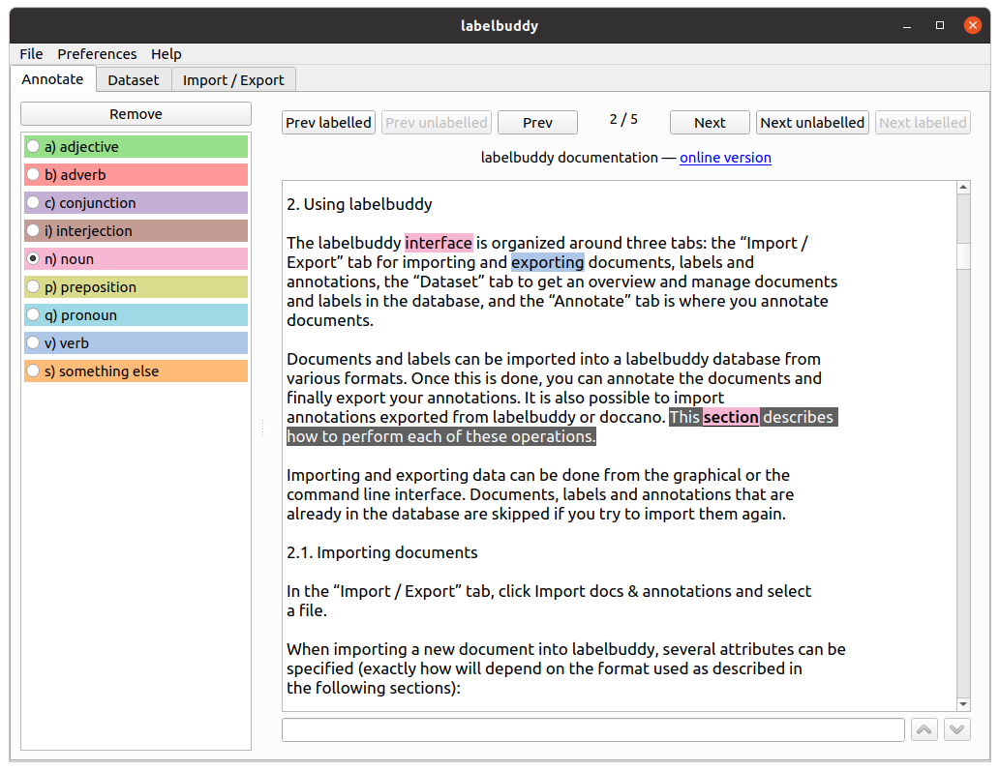
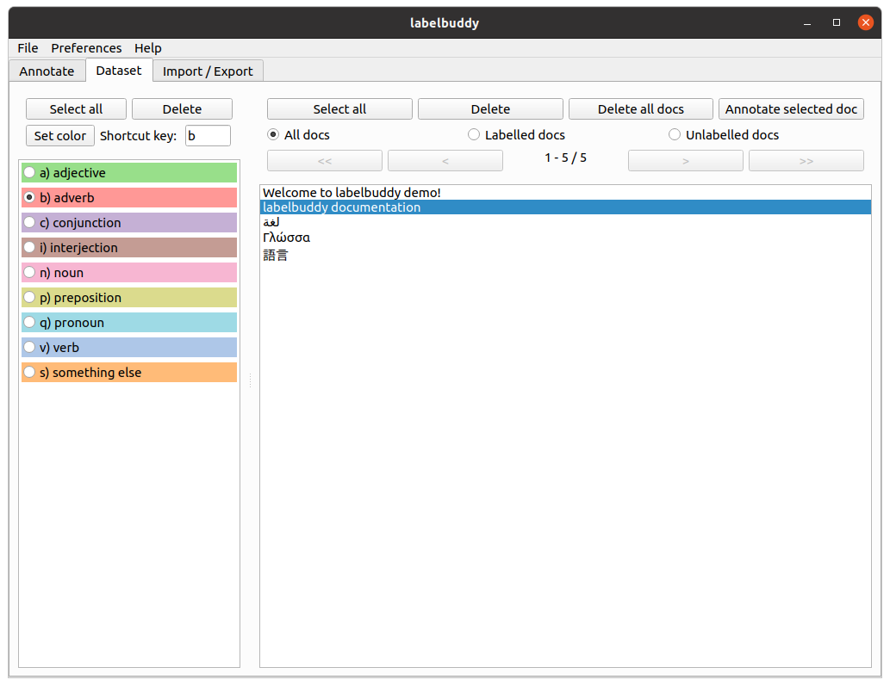
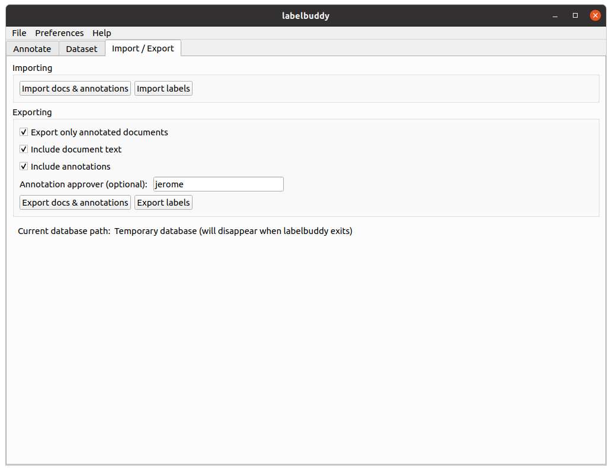

= labelbuddy screenshots
:figure-caption!:

<<index.adoc#,Back to labelbuddy home>>

.Annotating a document

.Managing the documents and labels; choosing a document to annotate

.Importing (exporting) documents and labels from (to) plain text files

<<index.adoc#,Back to labelbuddy home>>
